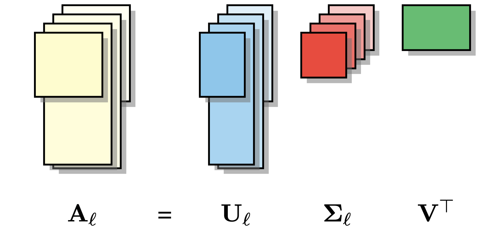

<p align="center" width="100%">

</p>

# A Joint Matrix Factorization Analysis of Multilingual Representations
This repository contains code for the paper "[A Joint Matrix Factorization Analysis of Multilingual Representations](https://aclanthology.org/2023.findings-emnlp.851.pdf)".


## Creating Conda Environment
The following instructions will assume that conda is already installed on your system.
1. Clone this repository.
2. Run the following command to create the conda environment from the provided `environment.yml` file:
   ```
   conda env create -f environment.yml
   ```
3. Activate the enviroment using the following command:
   ```
   conda activate joint-multilingual-analysis
   ```

## Obtaining and Preprocessing Pretraining Data
We use CoNLL’s 2017 Wikipedia dump for pretraining our models. To obtain the data, see instructions adopted from [Fujinuma et al. (2022)](https://github.com/akkikiki/multilingual_zeroshot_analysis):
1. Obtain CoNLL 2017 Wikipedia dump from https://lindat.mff.cuni.cz/repository/xmlui/handle/11234/1-1989. Or 
   ```
   wget https://lindat.mff.cuni.cz/repository/xmlui/bitstream/handle/11234/1-1989/English-annotated-conll17.tar
   ``` 
   and change "English" for other languages.
   Then extract the .tar file: 
   ```
   tar -xvf English-annotated-conll17.tar
   ```
2. Preprocess by obtaining the raw text by running 
   ```
   ./scripts/preprocess.sh
   ```
3. Downsample by running 
   ```
   ./scripts/downsample_train_dev.sh
   ```

## Pretraining
1. Run the following script for pretraining monolingual models. 
   ```
   ./scripts/train/pretrain_mono.sh
   ```
   Change `LANG` variable in the script to pretrain monlingual models for other languages. 
2. Run the following script for pretraining multilingual models. 
   ```
   ./scripts/train/pretrain_multi.sh
   ```
   The default setting will use all 33 langauges mentioned in the paper. To train other configurations mentioned in Section 5.2 of the paper (e.g. pretrain using a diverse set of languages), use `--langs_to_use` to include the desired set of languages. Examples are also provided in the commented out sections in the script. 

## Getting Morphosyntactic Features
We use treebanks from UD 2.1 which contain sentences annotated with morphosyntactic information. To obtain the data, see instructions adopted from [Stanczak et al. (2022)](https://github.com/copenlu/multilingual-typology-probing). 
1. Download [UD 2.1 treebanks](https://lindat.mff.cuni.cz/repository/xmlui/bitstream/handle/11234/1-2515/ud-treebanks-v2.1.tgz?sequence=4&isAllowed=y) and extract the .tgz file:
`tar -xvzf ud-treebanks-v2.1.tgz`. Then put them in `morphosyntactic_features/data/ud/ud-treebanks-v2.1`
2. Clone the [modified UD converter](https://github.com/unimorph/ud-compatibility) to this repo's parent folder (e.g. if this repo's path is `/path/to/parent/folder/joint_multilingual_analysis/` then the UD converter repo should be cloned under `/path/to/parent/folder/`). You can then convert the treebank annotations to the UniMorph schema using the following script:
   ```
   ./morphosyntactic_features/scripts/ud_to_um.sh
   ```
3. Run the following commands to preprocess all the relevant treebanks using relevant embeddings. This process may take a while. 
   ```
   cd morphosyntactic_features/ 
   ./scripts/preprocess_xlmr_base.sh
   ./scripts/preprocess_roberta_base.sh
   ```  


## PARAFAC2
To perform PARAFAC2 analysis, you will first need to preprocess the embeddings obtained from previous step. This can be done by running:
```
./scripts/analysis/preprocess.sh
``` 
This will create separate `*.npy` files in `./data/analysis_data/UD_*` storing representations for each layer and each morphosyntactic attributes for different languages. This step will also skip languages that does not have a particular morphosyntactic attribute. 

Our PARAFAC2 implementation is based on [tensorly](http://tensorly.org/stable/modules/generated/tensorly.decomposition.Parafac2.html#tensorly.decomposition.Parafac2) library. 

```
python src/analysis/parafac2.py \
    --treebanks_root /data/path/to/ud-treebanks-v2.1 \
    --output_dir /data/path/to/output/folder \
    --langs_to_use $LANGS \
    --filename_exp filename-for-your-experimental(multilingual)-model \
    --filename_ctl filename-for-your-control(monolingual)-model \
    --exp_name experiment-name \
    --do_parafac2 \
    --layer $LAYER \
    --rank $RANK \
    --verbose \
    --n_iter_max 100 \
    --attribute $ATTR
```
You will need to pass the following arguments:

- `--langs_to_use` sets the list of languages that you wish to perform the PARAFAC2 decomposition. E.g., `ar bg ca zh hr cs da nl en et fi fr gl de el he hi hu id it ja ko pl pt ro ru sk sl es sv tr uk vi` will run decomposition over all 33 supported languages in the paper. 
- `--layer` controls which layer (e.g. 0) to performn the decomposition.
- `--rank` sets the number of components in the decomposition. In our paper, we set `RANK=768` which is the dimension of our model embeddings. 
- `--verbose` only use this argument if you would like to see details from each iteration. 
- `--n_iter_max` sets the maximum number of iterations in the decomposition algorithm. If unset, the default is 2000.
- `--attribute` sets which morphosyntactic attributes to perform the decomposition. The list can be found at `src/analysis/res/properties.lst`.

Alternatively, you could also use the provided script to run the PARAFAC2 decomposition: 
```
./scripts/analysis/analysis.sh
```

Once the decomposition has finished, the results will be saved in the folder `./data/analysis_data/decompositions` in python pickle files. The filenames are in the format of `{EXP_NAME}-LAYER-{LAYER_NUM}-ATTR-{ATTRIBUTE_NAME}.pickle`. You can then run analysis over these files. 

The provided example below will calculate the average signature values for each language for layer `0` for the `Part-of-Speech` attribute:

```python
>>> import numpy as np
>>> import os, pickle

# load the pickled decomposition file
>>> file_path = os.path.join("./data/analysis_data/decompositions", "{}-LAYER-{}-ATTR-{}.pickle".format("all33", 0, "POS"))
>>> decompositions = pickle.load(open(file_path, 'rb'))
>>> (weights, factors, projections) = decompositions

# A contains the signature for each l-th language, it has a shape of [num_lang x embedding_dim] 
>>> A, B, C = factors

# we can get the average signature for all languages below
>>> signature_avg = np.average(A, axis=1)
```
To read more about what `A`, `B`, `C`, `weights`, `projections` represent, you can visit [this](http://tensorly.org/stable/modules/generated/tensorly.decomposition.Parafac2.html) page. 

## Citation
```
@inproceedings{zhao-etal-2023-joint,
    title = "A Joint Matrix Factorization Analysis of Multilingual Representations",
    author = "Zhao, Zheng  and
      Ziser, Yftah  and
      Webber, Bonnie  and
      Cohen, Shay",
    editor = "Bouamor, Houda  and
      Pino, Juan  and
      Bali, Kalika",
    booktitle = "Findings of the Association for Computational Linguistics: EMNLP 2023",
    month = dec,
    year = "2023",
    address = "Singapore",
    publisher = "Association for Computational Linguistics",
    url = "https://aclanthology.org/2023.findings-emnlp.851",
    doi = "10.18653/v1/2023.findings-emnlp.851",
    pages = "12764--12783",
}
```


